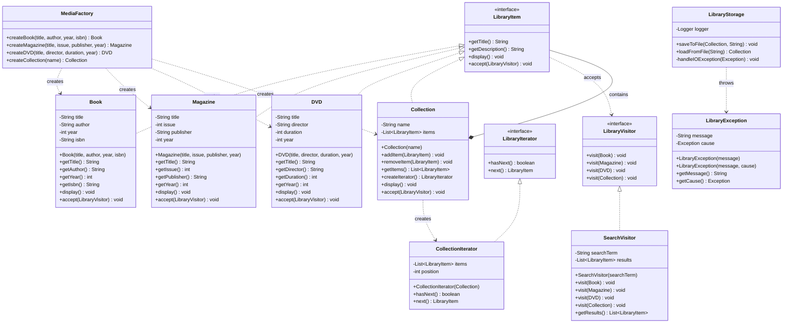

# 📚 Sistema di Gestione Biblioteca

Questo progetto implementa un sistema di gestione per una biblioteca, che permette di catalogare, organizzare e cercare vari tipi di media (libri, riviste, DVD). Il sistema è stato sviluppato seguendo le best practice di programmazione orientata agli oggetti, con particolare attenzione all'uso di design pattern, gestione delle eccezioni, e tecnologie core di Java.

## Panoramica delle Funzionalità

Il sistema permette di:

- **Creare e gestire diversi tipi di media** (libri, riviste, DVD)
- **Organizzare i media in collezioni gerarchiche** (una collezione può contenere altre collezioni)
- **Cercare elementi nella biblioteca** per titolo, autore, ecc.
- **Salvare e caricare il catalogo** da file
- **Logging delle operazioni** per tracciare l'utilizzo del sistema

## Tecnologie e Pattern Utilizzati

### Design Pattern

1. **🏭 Factory Pattern**
   - Implementato tramite la classe `MediaFactory`
   - Permette la creazione di vari tipi di media (libri, riviste, DVD, collezioni)
   - **Giustificazione**: Separa la creazione degli oggetti dal loro uso, semplificando l'aggiunta di nuovi tipi di media in futuro

2. ** Composite Pattern**
   - Implementato tramite l'interfaccia `LibraryItem` e le classi concrete (`Book`, `Magazine`, `DVD`, `Collection`)
   - Permette di trattare singoli oggetti e composizioni di oggetti in modo uniforme
   - **Giustificazione**: Ideale per rappresentare la struttura gerarchica di una biblioteca, dove collezioni possono contenere sia elementi singoli che altre collezioni

3. ** Iterator Pattern**
   - Implementato tramite l'interfaccia `LibraryIterator` e la classe `CollectionIterator`
   - Fornisce un modo per attraversare la struttura della biblioteca senza esporne la rappresentazione interna
   - **Giustificazione**: Consente di iterare sulla collezione in modo standardizzato

4. ** Exception Shielding**
   - Implementato tramite la classe `LibraryException`
   - Incapsula le eccezioni interne esponendo solo informazioni appropriate
   - **Giustificazione**: Migliora la sicurezza nascondendo dettagli implementativi interni nelle eccezioni

5. ** Visitor Pattern**
   - Implementato tramite l'interfaccia `LibraryVisitor` e la classe `SearchVisitor`
   - Separa gli algoritmi dalla struttura degli oggetti su cui operano
   - **Giustificazione**: Permette di aggiungere nuove operazioni sulla struttura senza modificarla

### Tecnologie Core di Java

1. ** Collections Framework**
   - Uso di `ArrayList` e altre collezioni per gestire gli elementi della biblioteca
   - **Giustificazione**: Fornisce strutture dati efficienti e thread-safe

2. ** Generics**
   - Implementati nelle collezioni e negli iteratori
   - **Giustificazione**: Garantisce type-safety e riduce il casting esplicito

3. ** Java I/O**
   - Implementato nella classe `LibraryStorage` per salvare e caricare il catalogo
   - **Giustificazione**: Permette la persistenza dei dati su file

4. ** Logging**
   - Uso di `java.util.logging` per tracciare operazioni e errori
   - **Giustificazione**: Facilita il debugging e il monitoraggio del sistema

5. ** JUnit Testing**
   - Test unitari per tutte le classi principali
   - **Giustificazione**: Assicura la qualità e la correttezza dell'implementazione

### 🔐 Sicurezza

1. **Input Sanitization**
   - Implementata nella classe `LibraryStorage` per prevenire directory traversal attacks
   - **Giustificazione**: Previene vulnerabilità di sicurezza legate ai file

2. **No Hardcoded Secrets**
   - Nessuna credenziale o informazione sensibile nel codice
   - **Giustificazione**: Best practice di sicurezza

3. **Controlled Exception Propagation**
   - Eccezioni gestite e incapsulate tramite exception shielding
   - **Giustificazione**: Evita la divulgazione di informazioni sensibili attraverso stack traces

## 📁 Struttura del Progetto

```
src/library/
├── test/                           📁 Package per test unitari
│   └── BasicTest.java              🧪 Test JUnit per Design Patterns
├── Main.java                       🎮 Applicazione principale con menu
├── LibraryItem.java                📋 Interfaccia base per tutti gli item
├── Book.java                       📖 Classe libro con validazione
├── Magazine.java                   📰 Classe rivista  
├── DVD.java                        💿 Classe DVD
├── Collection.java                 📦 Composite Pattern - collezioni
├── MediaFactory.java               🏭 Factory Pattern - creazione oggetti
├── SearchVisitor.java              🔍 Visitor Pattern - ricerca
├── LibraryVisitor.java             👁️ Interfaccia Visitor
├── LibraryIterator.java            🔄 Iterator Pattern - interfaccia
├── CollectionIterator.java         🔄 Iterator Pattern - implementazione
├── LibraryStorage.java             💾 Gestione I/O e serializzazione
└── LibraryException.java           ⚠️ Exception Shielding
```

## Istruzioni di Setup ed Esecuzione

### Prerequisiti
- Java Development Kit (JDK) 11 o superiore
- IDE (Eclipse, IntelliJ IDEA, VS Code)

### Setup
1. Clone il repository:
   ```bash
   git clone https://github.com/FrancoGitHub2023/sistema-biblioteca-java.git
   ```

2. Importa il progetto nel tuo IDE preferito

### Esecuzione
1. Esegui la classe `Main` dal package `library` per avviare l'applicazione
2. Per eseguire i test JUnit, esegui le classi di test dal tuo IDE

## Menu dell'Applicazione

```
===== BIBLIOTECA SYSTEM =====
1. Visualizza catalogo (Composite Pattern)
2. Cerca elementi (Visitor Pattern)
3. Aggiungi nuovo libro (Factory Pattern)
4. Aggiungi nuova rivista (Factory Pattern)
5. Aggiungi nuovo DVD (Factory Pattern)
6. Crea nuova collezione (Composite)
7. Salva catalogo (Java I/O + Exception Shielding)
8. Carica catalogo (Java I/O + Exception Shielding)
9. Dimostrazione del Iterator pattern
0. Esci
```

## 📊 Diagramma UML delle Classi



## 🧪 Testing

- **JUnit 5** per unit testing delle classi principali
- **Test coverage** sui design pattern implementati  
- **Test edge cases** per validazione robusta degli input
- **BasicTest.java** include test per:
  - Factory Pattern (creazione oggetti)
  - Composite Pattern (strutture gerarchiche)
  - Visitor Pattern (ricerca e attraversamento)
  - Iterator Pattern (iterazione collezioni)
  - Exception Shielding (gestione errori)

## ⚠️ Limitazioni Conosciute e Sviluppi Futuri

### Limitazioni
- Il sistema attualmente supporta solo l'archiviazione su file locale
- La ricerca è basata solo su corrispondenze di stringhe (case-insensitive)
- Non è implementata la gestione completa delle collezioni tramite menu

### Sviluppi Futuri
- Aggiungere supporto per database relazionali o NoSQL
- Implementare ricerca avanzata con filtri multipli
- Aggiungere sistema di autenticazione e autorizzazione
- Sviluppare interfaccia grafica (JavaFX/Swing)
- Implementare gestione completa collezioni nel menu
- Aggiungere funzionalità di prestito e restituzione

## Autore
**Francesco Di Monda**  
Corso Epicode: Programmazione Orientata agli Oggetti  
Anno Accademico: 2024/2025

## Licenza
Progetto didattico - Uso educativo

---

